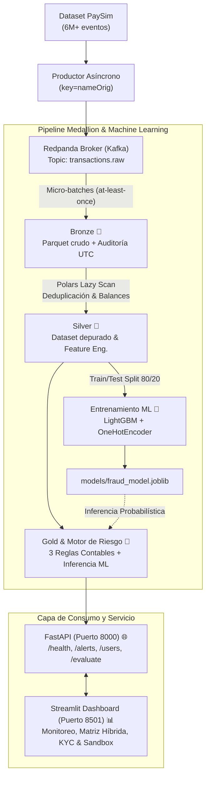

# 🛡️ Fintech Fraud Detection Platform

[](https://www.python.org/)
[](https://docs.astral.sh/uv/)
[-FD3B2A?style=for-the-badge&logo=apachekafka&logoColor=white)](https://redpanda.com/)
[](https://pola.rs/)
[](https://lightgbm.readthedocs.io/)
[](https://fastapi.tiangolo.com/)
[](https://streamlit.io/)
[](https://docs.pytest.org/)
[](https://github.com/CodeJairo/fraud-detection/actions/workflows/ci.yml)

Plataforma integral de **detección de fraude financiero en streaming, procesamiento analítico lakehouse y Machine Learning supervisado**, construida bajo la **Arquitectura Medallion** (*Bronze, Silver, Gold*).

El sistema ingesta flujos de eventos transaccionales en tiempo real, reconcilia discrepancias contables de balance con **Polars**, entrena clasificadores Gradient Boosting (**LightGBM**) con balanceo de clases, evalúa riesgo mediante un **score híbrido** (reglas de negocio + probabilidad estadística) y expone tanto un **microservicio REST asíncrono** (<5ms) como un **centro de control interactivo en Streamlit**.

---

## 🏗️ Arquitectura del Sistema



---

## ⚡ Especificación del Pipeline por Capas

| Capa / Módulo | Tecnología | Función Principal | Decisiones Técnicas Clave |
| :--- | :--- | :--- | :--- |
| **Bronze** 🥉 | Redpanda + PyArrow | Ingesta cruda y almacenamiento inmutable | Particionado estricto por `nameOrig`, micro-batches dinámicos (tamaño/tiempo) y commit manual síncrono *at-least-once*. |
| **Silver** 🥈 | Polars | Limpieza, deduplicación y feature engineering | Deduplicación por clave compuesta de negocio y cálculo de ecuaciones contables: $\text{err} = (\text{saldo\_ant} \pm \text{monto}) - \text{saldo\_nuevo}$. |
| **Machine Learning** 🤖 | LightGBM + Scikit-Learn | Clasificación supervisada de fraude | Manejo de clases desbalanceadas (`class_weight='balanced'`), validación con PR-AUC/ROC-AUC y serialización en `models/`. |
| **Gold** 🥇 | Motor Híbrido | Scoring de riesgo y datasets analíticos | Score unificado: $\text{risk} = 0.5 \times \text{reglas} + 0.5 \times (\text{ml\_prob} \times 100)$. Emite `fraud_alerts` y perfiles acumulados `user_risk_profile`. |
| **API REST** 🌐 | FastAPI + Pydantic v2 | Servicio de consulta y scoring en vivo | Consulta de alertas y evaluación de transacciones en tiempo real (`POST /evaluate`) con latencia `<5ms`. |
| **Dashboard** 📊 | Streamlit + Plotly | Centro de comando y sandbox interactivo | Visualización ejecutiva, matriz de decisión híbrida (4 cuadrantes), auditoría forense KYC con 1 clic y simulador en vivo. |

### 📖 Reglas de Negocio Implementadas
1. **Inconsistencia Severa de Saldos (50 pts)**: Discrepancia contable $\ne 0$ en `TRANSFER` o `CASH_OUT` con montos $\ge \$200,000$.
2. **Transferencia a Cero Destino (35 pts)**: Transferencias $\ge \$200,000$ hacia cuentas sin saldo previo ni posterior (cuentas mula).
3. **Ráfaga Operativa (25 pts)**: $\ge 2$ transacciones de alto impacto de un mismo usuario en el mismo paso temporal (`step`).

---

## 🚀 Puesta en Marcha Rápida (Quickstart)

### 1. Clonar e Instalar Dependencias
```bash
git clone https://github.com/CodeJairo/fraud-detection.git
cd fraud-detection
uv sync
```

### 2. Iniciar Infraestructura de Streaming
```bash
docker compose up -d
docker exec redpanda rpk topic create transactions.raw --partitions 3
```
* Redpanda Console interactiva: [http://localhost:8080](http://localhost:8080)

### 3. Ejecutar Pipeline Completo (De Streaming a Gold)
```bash
# 1. Emitir eventos simulados al topic
uv run python -m src.producer.producer --limit 2000

# 2. Ingestar micro-lotes crudos en Bronze
uv run python -m src.pipeline.bronze --max-messages 2000

# 3. Limpiar y generar features en Silver (Polars)
uv run python -m src.pipeline.silver

# 4. Entrenar modelo de clasificación LightGBM
uv run python -m src.ml.train

# 5. Generar alertas híbridas y perfiles en Gold
uv run python -m src.pipeline.gold
```

### 4. Iniciar Servicios Web
```bash
# Terminal 1: Backend FastAPI (Documentación Swagger en http://localhost:8000/docs)
uv run uvicorn src.api.main:app --port 8000 --reload

# Terminal 2: Centro de Comando Streamlit (http://localhost:8501)
uv run streamlit run src/ui/app.py
```

---

## 🧪 Pruebas Automatizadas

Suite completa de 35 pruebas unitarias y de integración end-to-end:

```bash
uv run pytest tests/ -q
```
```text
35 passed, 1 warning in 3.17s (100% Passing)
```

---

## 📁 Estructura del Repositorio

```text
fintech-fraud-detection/
├── docker-compose.yml       # Broker Redpanda y Redpanda Console
├── pyproject.toml           # Dependencias uv y configuración de pytest
├── models/                  # Pipeline serializado (fraud_model.joblib) y métricas
├── data/                    # Datasets (paysim.csv, data/bronze/, data/silver/, data/gold/)
├── src/
│   ├── api/                 # Endpoints FastAPI (/health, /alerts, /users, /evaluate)
│   ├── config/              # Modelos Pydantic v2 y configuración
│   ├── ml/                  # Entrenamiento LightGBM y utilidades de inferencia
│   ├── pipeline/            # Procesadores Bronze, Silver (Polars) y Gold (Motor Híbrido)
│   ├── producer/            # Productor de streaming Kafka/Redpanda
│   └── ui/                  # Centro de Comando Streamlit + Plotly
└── tests/                   # Suite completa de pruebas (API, Bronze, Silver, Gold, ML, UI)
```

---

## 💡 Metodología de Desarrollo y Autoría

> **Desarrollo Asistido por Agentes de Código Autónomos**: Proyecto concebido y construido aplicando flujos de ingeniería agéntica rigurosa (*Pair Programming asistido por IA con Google DeepMind Antigravity*), estructuración arquitectónica declarativa (`/plan`), pruebas TDD y commits modulares atómicos.

**Autor**: CodeJairo (<jairoehr@gmail.com>)
