# 🛡️ Fintech Fraud Detection Platform

[](https://www.python.org/)
[](https://docs.astral.sh/uv/)
[-FD3B2A?style=for-the-badge&logo=apachekafka&logoColor=white)](https://redpanda.com/)
[](https://pola.rs/)
[](https://fastapi.tiangolo.com/)
[](https://streamlit.io/)
[](https://docs.pytest.org/)

Plataforma integral de **detección de fraude financiero en streaming y procesamiento analítico por lotes**, construida siguiendo los estándares de la **Arquitectura Medallion** (*Bronze, Silver, Gold*). 

El sistema ingesta flujos masivos de eventos transaccionales en tiempo real, aplica reglas contables de negocio y reconciliación de balances, perfiles de riesgo por cliente, y expone tanto un **microservicio REST asíncrono** de alto rendimiento como un **dashboard interactivo** para analistas de riesgo y cumplimiento normativo (*Compliance*).

---

## 🤖 Ingeniería Asistida por Agentes Autónomos de Código

> [!NOTE]
> **Metodología de Desarrollo y Orquestación de Agentes**  
> Este proyecto fue concebido, estructurado e implementado aplicando metodologías avanzadas de **Ingeniería Agentica y Pair Programming con Agentes de IA (Google DeepMind Antigravity)**.
>
> Lejos de un uso superficial de completado de código, el desarrollo se ejecutó mediante un flujo de orquestación riguroso:
> 1. **Planificación Arquitectónica Declarativa (`/plan`)**: Descomposición sistemática de requisitos en artefactos de diseño técnico, contratos de interfaz y diagramas antes de ejecutar cualquier modificación en el código.
> 2. **Desarrollo Guiado por Pruebas (TDD) y Auto-Verificación**: Ejecución de suites unitarias y de integración end-to-end con retroalimentación automática y resolución reactiva de errores en tiempo de ejecución.
> 3. **Commits Modulares Atómicos**: Seguimiento estricto del estándar *Conventional Commits* en etapas delimitadas (`infra`, `build`, `feat(config)`, `feat(producer)`, `feat(bronze)`, `feat(silver)`, `feat(gold)`, `feat(api)`, `feat(ui)`).
> 4. **Resiliencia de Sistemas**: Diagnóstico y corrección autónoma de problemas de infraestructura (parámetros de Schema Registry en Redpanda, ordenamiento multihilo en Polars y manejo de señales POSIX para apagado ordenado).

---

## 🏛️ Arquitectura General del Sistema

El flujo de datos sigue un ciclo desacoplado de eventos y computación vectorizada:

```mermaid
flowchart TD
    subgraph Data_Source ["Fuente de Datos"]
        CSV["Dataset PaySim\n(6M+ transacciones)"]
    end

    subgraph Streaming_Ingestion ["Ingesta en Streaming"]
        PROD["Productor Asíncrono\n(src/producer/producer.py)"]
        BROKER["Redpanda Broker (Kafka API)\nTopic: transactions.raw (3 Particiones)"]
        CSV --> PROD
        PROD -->|"Particionado por key=nameOrig"| BROKER
    end

    subgraph Medallion_Architecture ["Pipeline de Datos Medallion"]
        BRONZE["🥉 Capa Bronze (Raw Ingestion)\n- Micro-batching (tamaño/timeout)\n- Metadatos de auditoría (UTC, offset)\n- Garantía At-Least-Once\n- Parquet Snappy particionado"]
        SILVER["🥈 Capa Silver (Curated & Enriched)\n- Polars Lazy Scan (Out-of-core)\n- Deduplicación por clave de negocio\n- Extracción de tipo de cuenta (Client/Merchant)\n- Feature Engineering de balances"]
        GOLD["🥇 Capa Gold (Business & Risk Engine)\n- Motor vectorizado de 3 reglas de fraude\n- Scoring ponderado (0-100) y severidad\n- Tabla: fraud_alerts\n- Tabla: user_risk_profile"]

        BROKER --> BRONZE
        BRONZE -->|"data/bronze/transactions/"| SILVER
        SILVER -->|"data/silver/transactions/"| GOLD
    end

    subgraph Serving_Layer ["Capa de Consumo y Exposición"]
        API["🚀 Microservicio FastAPI (Puerto 8000)\n- GET /health (Inventario Medallion)\n- GET /alerts (Filtrado & Paginación)\n- GET /users/{id}/risk-profile"]
        UI["📊 Dashboard Streamlit (Puerto 8501)\n- KPIs Ejecutivos & Gráficos Plotly\n- Auditoría de Alertas & Exportación CSV\n- Ficha Técnica de Riesgo del Cliente"]

        GOLD -->|"data/gold/fraud_alerts/\ndata/gold/user_risk_profile/"| API
        API <-->|"Peticiones HTTP (requests)"| UI
    end
```



---

## ⚙️ Especificación Técnica de las Capas

### 🥉 1. Capa Bronze: Ingesta Cruda en Streaming
* **Objetivo**: Capturar el flujo continuo de transacciones desde Redpanda sin alterar los valores de origen, agregando trazabilidad de auditoría.
* **Componentes**:
  * **Productor ([src/producer/producer.py](file:///home/codejairo/Proyectos/fintech-fraud-detection/src/producer/producer.py))**: Lee el dataset de PaySim por chunks y serializa en JSON. Utiliza `nameOrig` como clave de partición, asegurando que las transacciones del mismo usuario aterricen en la misma partición y mantengan orden secuencial estricto.
  * **Consumidor Bronze ([src/pipeline/bronze.py](file:///home/codejairo/Proyectos/fintech-fraud-detection/src/pipeline/bronze.py))**: Consumo por micro-lotes (basado en tamaño `batch_size=500` o tiempo `batch_timeout_sec=5.0s`).
  * **Garantía *At-Least-Once***: `enable.auto.commit = False`. El commit manual síncrono del offset a Kafka se ejecuta **exclusivamente después** de que el archivo Parquet ha sido persistido y cerrado en disco.
  * **Metadatos de auditoría**: Inyección de `ingested_at` (UTC ISO 8601), `ingestion_date`, `kafka_partition`, `kafka_offset` y `kafka_timestamp`.
  * **Almacenamiento**: `data/bronze/transactions/ingestion_date=YYYY-MM-DD/bronze_batch_*.parquet`.

---

### 🥈 2. Capa Silver: Limpieza, Normalización y Feature Engineering
* **Objetivo**: Convertir los datos crudos en un dataset estructurado, libre de duplicados y enriquecido con variables contables.
* **Motor Analítico**: Implementado en **Polars** (`polars>=2.0.0`) aprovechando ejecución vectorizada en Rust sin requerir inicialización de la JVM de Java.
* **Transformaciones ([src/pipeline/silver.py](file:///home/codejairo/Proyectos/fintech-fraud-detection/src/pipeline/silver.py))**:
  * **Deduplicación de Negocio**: Eliminación de duplicados mediante la clave compuesta:
    $$\text{Clave} = [\text{nameOrig}, \text{nameDest}, \text{amount}, \text{step}, \text{kafka\_offset}]$$
  * **Normalización de Cuentas**: Extracción categórica a partir de prefijos (`C` $\rightarrow$ `CLIENT`, `M` $\rightarrow$ `MERCHANT`).
  * **Ingeniería de Características de Balances (Ecuaciones Contables)**:
    $$\text{balance\_error\_orig} = (\text{oldbalanceOrg} - \text{amount}) - \text{newbalanceOrig}$$
    $$\text{balance\_error\_dest} = (\text{oldbalanceDest} + \text{amount}) - \text{newbalanceDest}$$
    *(En transferencias legítimas el error es 0. En transacciones fraudulentas de vaciado, revela discrepancias masivas inmediatas).*
  * **Almacenamiento**: `data/silver/transactions/ingestion_date=YYYY-MM-DD/silver_clean_*.parquet`.

---

### 🥇 3. Capa Gold: Métricas de Negocio y Motor de Reglas de Fraude
* **Objetivo**: Evaluar vectorizadamente patrones delictivos, emitir alertas y construir vistas agregadas de riesgo por cliente.
* **Motor de Reglas ([src/pipeline/gold.py](file:///home/codejairo/Proyectos/fintech-fraud-detection/src/pipeline/gold.py))**:
  * **Regla 1 (Inconsistencia Severa de Saldo - 50 pts)**: Dispara cuando $\text{balance\_error\_orig} \ne 0$ en transacciones de tipo `TRANSFER` o `CASH_OUT` con montos $\ge \$200,000$.
  * **Regla 2 (Transferencia a Destino con Saldo Cero - 35 pts)**: Dispara cuando una operación `TRANSFER` $\ge \$200,000$ tiene como destino una cuenta sin balance previo ni posterior (patrón de mula financiera o cuenta puente).
  * **Regla 3 (Ráfaga Operativa en la Misma Hora - 25 pts)**: Dispara cuando una cuenta de origen realiza $\ge 2$ transacciones en el mismo paso temporal (`step`).
  * **Scoring y Clasificación**:
    $$\text{Score} = 50 \cdot R_1 + 35 \cdot R_2 + 25 \cdot R_3 \quad (\text{Rango: } 0 - 100)$$
    * `HIGH`: $\text{Score} \ge 60$
    * `MEDIUM`: $35 \le \text{Score} < 60$
    * `LOW`: $0 < \text{Score} < 35$ (No genera alerta activa)
* **Datasets Resultantes**:
  * **`fraud_alerts`**: Registro de alertas con score $\ge 35$, UUID único, marcas de tiempo y lista limpia de reglas violadas (`rules_triggered`).
  * **`user_risk_profile`**: Perfil analítico agrupado por cliente (`nameOrig`) calculando volumen total acumulado, desglose por tipo de operación, tasa de alertas emitidas y categoría de riesgo del cliente (`user_risk_level`: `LOW`, `MEDIUM`, `HIGH`).

---

## 🚀 4. Capa de Servicio: API REST y Dashboard

### Microservicio FastAPI ([src/api/main.py](file:///home/codejairo/Proyectos/fintech-fraud-detection/src/api/main.py))
Servidor asíncrono con Uvicorn y validación de tipos con Pydantic:

| Método | Endpoint | Descripción | Parámetros Query |
| :--- | :--- | :--- | :--- |
| `GET` | `/health` | Estado del servicio y conteo de archivos/registros por capa | Ninguno |
| `GET` | `/alerts` | Consulta paginada de alertas de fraude | `risk_level`, `rule`, `limit`, `offset` |
| `GET` | `/users/{name_orig}/risk-profile` | Consulta directa del perfil de riesgo de un cliente | `name_orig` (Path) |

* **Documentación Interactiva Swagger UI**: `http://localhost:8000/docs`

---

### Dashboard Streamlit ([src/ui/app.py](file:///home/codejairo/Proyectos/fintech-fraud-detection/src/ui/app.py))
Panel web interactivo con Plotly para analistas de riesgo:
1. **📊 Resumen General**: Monitoreo de salud del sistema, gráfico Donut de severidad de riesgo y gráficos de distribución por tipo de transacción.
2. **🚨 Monitor de Alertas**: Filtrado dinámico por nivel de riesgo o término de regla (ej. `rule=balance`), tabla formateada y botón de descarga directa en **CSV**.
3. **👤 Perfil de Cliente**: Búsqueda por ID de cuenta (`nameOrig`), tarjeta de KPIs con badges visuales de riesgo y visor JSON expandible.

---

## 🧪 Pruebas Automatizadas

El proyecto cuenta con una suite integral de **24 pruebas automatizadas** que validan desde la ingesta en streaming hasta los endpoints de FastAPI y la interfaz:

```bash
uv run pytest tests/ -v
```

```text
tests/test_api.py::test_api_health PASSED                                [  4%]
tests/test_api.py::test_api_alerts_unfiltered PASSED                     [  8%]
tests/test_api.py::test_api_alerts_filtered_by_risk_level PASSED         [ 12%]
tests/test_api.py::test_api_alerts_filtered_by_rule PASSED               [ 16%]
tests/test_api.py::test_api_user_risk_profile_existing PASSED            [ 20%]
tests/test_api.py::test_api_user_risk_profile_not_found PASSED           [ 25%]
tests/test_bronze.py::test_transaction_event_schema_validation PASSED    [ 29%]
tests/test_bronze.py::test_bronze_record_enrichment PASSED               [ 33%]
tests/test_bronze.py::test_bronze_flush_batch_to_parquet PASSED          [ 37%]
tests/test_gold.py::test_gold_rule_1_balance_inconsistency PASSED        [ 41%]
tests/test_gold.py::test_gold_rule_2_large_transfer_zero_dest PASSED     [ 45%]
tests/test_gold.py::test_gold_rule_3_burst_frequency PASSED              [ 50%]
tests/test_gold.py::test_gold_combined_score_and_alert_extraction PASSED [ 54%]
tests/test_gold.py::test_gold_user_risk_profile_aggregation PASSED       [ 58%]
tests/test_gold.py::test_gold_pipeline_end_to_end PASSED                 [ 62%]
tests/test_silver.py::test_account_type_extraction PASSED                [ 66%]
tests/test_silver.py::test_balance_error_calculations PASSED             [ 70%]
tests/test_silver.py::test_deduplication PASSED                          [ 75%]
tests/test_silver.py::test_clean_and_filter_invalid_rows PASSED          [ 79%]
tests/test_silver.py::test_silver_pipeline_end_to_end PASSED             [ 83%]
tests/test_ui.py::test_fetch_data_success PASSED                         [ 87%]
tests/test_ui.py::test_fetch_data_404_error PASSED                       [ 91%]
tests/test_ui.py::test_fetch_data_connection_error PASSED                [ 95%]
tests/test_ui.py::test_app_module_imports PASSED                         [100%]

======================== 24 passed in 2.72s =========================
```

---

## 🛠️ Guía de Puesta en Marcha (Quickstart)

### 1. Requisitos Previos
* **Python 3.14+**
* [uv](https://docs.astral.sh/uv/) instalado (`curl -LsSf https://astral.sh/uv/install.sh | sh`)
* **Docker & Docker Compose**

### 2. Clonación e Instalación
```bash
git clone https://github.com/tu-usuario/fintech-fraud-detection.git
cd fintech-fraud-detection

# Sincronizar el entorno virtual con uv
uv sync
```

### 3. Iniciar Servicios de Infraestructura
```bash
# Levantar Redpanda Broker y Redpanda Console
docker compose up -d

# Crear el topic con 3 particiones
docker exec redpanda rpk topic create transactions.raw --partitions 3
```
* Acceso a **Redpanda Console**: [http://localhost:8080](http://localhost:8080)

### 4. Ejecución del Pipeline Medallion
```bash
# 1. Transmitir transacciones al topic de Redpanda
uv run python -m src.producer.producer --limit 2000

# 2. Ingestar micro-lotes en la Capa Bronze (Parquet)
uv run python -m src.pipeline.bronze --max-messages 2000

# 3. Limpiar y enriquecer en la Capa Silver (Polars)
uv run python -m src.pipeline.silver

# 4. Evaluar reglas de fraude y generar perfiles en la Capa Gold
uv run python -m src.pipeline.gold
```

### 5. Iniciar la Capa de Exposición (API & Dashboard)

* **Terminal 1: Backend (FastAPI)**
  ```bash
  uv run uvicorn src.api.main:app --port 8000 --reload
  ```
  * Swagger UI disponible en: [http://localhost:8000/docs](http://localhost:8000/docs)

* **Terminal 2: Frontend (Streamlit)**
  ```bash
  uv run streamlit run src/ui/app.py
  ```
  * Dashboard disponible en: [http://localhost:8501](http://localhost:8501)

---

## 📁 Estructura del Repositorio

```text
fintech-fraud-detection/
├── docker-compose.yml       # Definición de servicios Redpanda & Redpanda Console
├── pyproject.toml           # Dependencias del proyecto y configuración de pytest
├── uv.lock                  # Lockfile determinista de dependencias
├── README.md                # Documentación técnica del proyecto
├── data/                    # Almacenamiento local de datos (ignorado por Git)
│   ├── paysim.csv           # Dataset de simulación transaccional
│   ├── bronze/transactions/ # Parquet crudos particionados con metadatos
│   ├── silver/transactions/ # Parquet curados con features de balances
│   └── gold/                # Datasets analíticos finales
│       ├── fraud_alerts/    # Alertas emitidas por el motor de reglas
│       └── user_risk_profile/ # Perfiles acumulados de clientes
├── src/
│   ├── api/                 # Microservicio REST
│   │   ├── __init__.py
│   │   └── main.py          # Endpoints FastAPI (/health, /alerts, /users)
│   ├── config/              # Configuración y esquemas
│   │   ├── __init__.py
│   │   ├── schemas.py       # Modelos Pydantic v2 (Bronze, Silver, Gold, API)
│   │   └── settings.py      # Variables de entorno y umbrales configurables
│   ├── pipeline/            # Procesamiento de datos Medallion
│   │   ├── __init__.py      # Exportaciones perezosas (PEP 562)
│   │   ├── bronze.py        # Consumidor Redpanda a Parquet (at-least-once)
│   │   ├── silver.py        # Limpieza, deduplicación y features con Polars
│   │   └── gold.py          # Motor de reglas de fraude y scoring
│   ├── producer/            # Productor de streaming
│   │   ├── __init__.py
│   │   └── producer.py      # Productor Kafka particionado por cuenta origen
│   └── ui/                  # Interfaz gráfica
│       ├── __init__.py
│       └── app.py           # Dashboard interactivo Streamlit + Plotly
└── tests/                   # Suite de pruebas automatizadas
    ├── __init__.py
    ├── test_api.py          # Tests de endpoints FastAPI (TestClient)
    ├── test_bronze.py       # Tests de ingesta y serialización Bronze
    ├── test_gold.py         # Tests de reglas contables y perfiles Gold
    ├── test_silver.py       # Tests de deduplicación y balance features Silver
    └── test_ui.py           # Tests de lógica de consumo del Dashboard
```

---

## 📜 Licencia y Autoría

Desarrollado como proyecto de referencia de ingeniería de datos y detección de fraude en fintech.  
**Autor**: CodeJairo (<jairoehr@gmail.com>)
